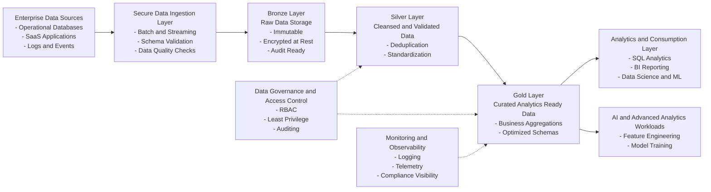

# Secure Lakehouse Architecture – Azure Databricks
> This repository is a reference architecture and design artifact.  
> Implementation notebooks are intentionally minimal and illustrative.
## Overview
This repository demonstrates a **secure, enterprise-grade Lakehouse reference architecture**
built on **Azure Databricks and Delta Lake**, designed to support **analytics and AI-ready workloads**
in regulated and large-scale enterprise environments.

The architecture emphasizes **security-by-design, governance, and scalability**, aligning with
banking and enterprise data platform standards.

---

## Architecture Highlights

- Secure data ingestion from multiple sources
- Medallion architecture (Bronze, Silver, Gold)
- Role-based access control and data governance
- Separation of compute, storage, and security boundaries
- AI-ready analytics foundation
---

## Execution Flow

1. **Bronze Ingestion**
   - Source: `data/sample/customer_events.json`
   - Notebook: `notebooks/bronze/bronze_ingestion_example.py`
   - Output: Delta tables in Bronze layer

2. **Silver Transformation**
   - Notebook: `notebooks/silver/silver_transformation_example.py`
   - Actions: cleansing, deduplication, schema enforcement
   - Output: governed Silver Delta tables

3. **Gold Aggregation**
   - Notebook: `notebooks/gold/gold_aggregation_example.py`
   - Actions: business aggregations and analytics-ready views
   - Output: curated Gold datasets for BI and ML
## Key Components

### Data Ingestion
- Batch and streaming ingestion patterns
- Secure landing zones
- Schema validation and enforcement

### Data Transformation
- Delta Lake ACID transactions
- Incremental transformations
- Optimized query performance

### Governance & Access Control
- Workspace-level and data-level security
- Role-based access control (RBAC)
- Least-privilege access patterns

### Security Controls
- Secure network boundaries
- Identity-driven access
- Encryption at rest and in transit
- Auditing and monitoring considerations

---

## Technology Stack

- Azure Databricks
- Delta Lake
- Azure Data Lake Storage
- SQL
- Python

---

## Enterprise Use Cases

- Banking and financial analytics
- Enterprise reporting and BI
- AI and machine learning workloads
- Compliance-aware data platforms

---

## Audience

This project is intended for:
- Solutions Architects
- Cloud & Data Architects
- Enterprise Data Platform Teams
- Technical leaders designing secure analytics platforms

---

## Author

**Goddy Otuwho**  
Senior Cloud & Security Architect  
LinkedIn: https://www.linkedin.com/in/goddyotuwho

⸻

Disclaimer

This repository is a reference implementation intended for demonstration and discussion purposes. It is not a production deployment and does not represent a fully hardened or performance-tuned solution.
